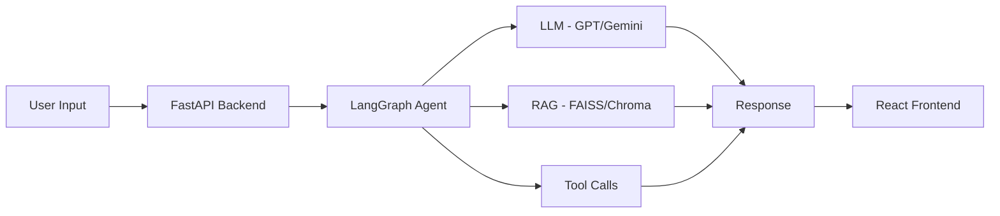

<!-- ═══════════════════════════════════════════════════════════════════ -->
<!--                     MAYANK — GITHUB PROFILE README                 -->
<!-- ═══════════════════════════════════════════════════════════════════ -->

<div align="center">

# Hi there, I'm Mayank 👋

### Full-Stack Engineer · AI/ML Engineer · DSA Grinder · Open-Source Contributor

*"Build things. Break things. Learn. Repeat."*

<br/>

[](https://git.io/typing-svg)

<br/>


</div>

---

## 🧑‍💻 About Me

> B.Tech IT student at ABESEC building at the intersection of **full-stack engineering** and **applied AI**. I ship production-grade MERN apps by day and architect LLM pipelines by night.

I write code that solves real problems — from FastAPI microservices powering AI chatbots to LangGraph multi-agent workflows. Every project I build is driven by clean architecture, measurable impact, and a commitment to never shipping mediocre work.

```
🔭  Building    →  LangGraph multi-agent systems + FastAPI RAG pipelines
🌱  Exploring   →  Generative AI · Machine Learning · Data Science · Blockchain
🤝  Open to     →  SWE Internships · AI/ML Roles · Full-Stack · Data Science
💬  Ask me      →  MERN Stack · LLM Pipelines · DSA · System Design · Git
⚡  Fun fact    →  Went from zero code knowledge to obsessed engineer — curiosity is my OS
```

**Actively seeking:** Software Engineering · AI/ML Engineering · Data Science · Full-Stack Development internships and roles for 2025/2026.

---

## 🛠️ Tech Stack & Skills

### 🔤 Languages


### 🤖 AI / LLM Engineering


| Skill | Tools |
|---|---|
| **LLM Orchestration** | LangChain · LangGraph · LlamaIndex |
| **AI APIs** | OpenAI GPT-4 · Gemini · Anthropic Claude |
| **RAG & Embeddings** | FAISS · ChromaDB · Sentence Transformers |
| **AI Chatbot Dev** | Multi-turn agents · Tool calling · Memory |
| **Backend AI APIs** | FastAPI · Pydantic · Async Python |

### 🌐 Full-Stack Development


| Layer | Technologies |
|---|---|
| **Frontend** | React.js · Tailwind CSS · HTML5 · CSS3 |
| **Backend** | Node.js · Express.js · FastAPI · REST APIs |
| **Database** | MongoDB · Mongoose · SQL basics |
| **Auth** | JWT · OAuth 2.0 · bcrypt |

### 📊 Data Science & ML


### 🔧 DevOps & Tools


---

## 🧩 LeetCode — 500+ Problems Solved

> **6-month consistent DSA streak** · Arrays → Recursion → DP → Graphs → System Design

<div align="center">


</div>

<br/>

| Difficulty | Problems Solved | Topics Mastered |
|---|---|---|
| 🟢 **Easy** | 210+ | Arrays · Strings · HashMaps · Two Pointers |
| 🟡 **Medium** | 220+ | Trees · DP · BFS/DFS · Sliding Window |
| 🔴 **Hard** | 70+ | Advanced DP · Segment Trees · Graph Algos |

**DSA Roadmap Progress:**

```
Arrays & Strings    ████████████████████  100%
Linked Lists        ████████████████████  100%
Trees & Graphs      ██████████████████░░   90%
Dynamic Programming ████████████████░░░░   80%
System Design       ███████████░░░░░░░░░   55%
```

---

## 📊 GitHub Stats

<div align="center">


<br/>


<br/>


</div>

---

## 🚀 What I'm Building



| Project Type | Status | Stack |
|---|---|---|
| 🤖 LangGraph multi-agent chatbot | 🔨 Building | LangGraph · FastAPI · React |
| 🔍 RAG pipeline with FAISS | 🔨 Building | LangChain · FastAPI · ChromaDB |
| 🌐 Full-stack MERN app | ✅ Shipped | React · Node · MongoDB |
| 📊 ML prediction service | 🔨 Building | scikit-learn · FastAPI · Docker |

---

## 🎯 Currently Learning

```
📌  LangGraph      →  Stateful multi-agent orchestration
📌  RAG Systems    →  Retrieval-Augmented Generation at scale
📌  System Design  →  HLD/LLD for SWE interviews
📌  ML Deployment  →  FastAPI + Docker + cloud hosting
📌  DSA            →  Daily LeetCode · 500+ solved · grinding hard
```

---

## 📂 Featured Projects

> ⭐ Pin your best 3–4 repos. Below is a template for each project README.

---

### 📋 Project README Template *(ATS & Recruiter Optimized)*

---

# [PROJECT_NAME]

<div align="center">


**[PROJECT_TAGLINE — one compelling sentence describing the project]**

[🔴 Live Demo](#) · [📖 API Docs](#) · [📊 Dataset](#) · [🐛 Report Bug](#)

</div>

---

## 📌 Executive Summary

### Problem Statement
> [DESCRIBE THE REAL-WORLD PROBLEM YOUR PROJECT SOLVES IN 2–3 SENTENCES]

### Why I Built This
[Explain motivation — internship prep, real need, learning goal, or hackathon.]

### Business Impact
| Metric | Value |
|---|---|
| Processing Speed | [X]% faster than baseline |
| Model Accuracy | [XX]% on test set |
| API Response Time | < [X]ms avg |
| Dataset Size | [X,XXX] records |

---

## 🏗️ Architecture Overview

```
┌─────────────────────────────────────────────────────────────┐
│                        CLIENT LAYER                         │
│               React.js Frontend (Tailwind CSS)              │
└─────────────────────────┬───────────────────────────────────┘
                          │ HTTP / WebSocket
┌─────────────────────────▼───────────────────────────────────┐
│                         API LAYER                           │
│              FastAPI Backend (Async Python)                 │
│          JWT Auth · Rate Limiting · CORS · Pydantic         │
└───────────┬─────────────────────────────┬───────────────────┘
            │                             │
┌───────────▼──────────┐     ┌───────────▼──────────────────┐
│     AI/ML ENGINE     │     │        DATA LAYER            │
│  LangChain/LangGraph │     │  MongoDB · FAISS · Redis     │
│  LLM · RAG · Agents  │     │  Vector Store · Cache        │
└──────────────────────┘     └──────────────────────────────┘
```

### Data Flow
```
Input → Validation (Pydantic) → Preprocessing → ML Model / LLM
     → Post-processing → Response Formatting → Client
```

---

## 🧰 Technology Stack

### Full Stack

| Layer | Technology | Purpose |
|---|---|---|
| **Frontend** | React.js + Tailwind CSS | UI / UX |
| **Backend** | FastAPI (Python 3.11) | REST API |
| **Database** | MongoDB + Mongoose | Data persistence |
| **Auth** | JWT + bcrypt | Secure authentication |
| **Cache** | Redis | Performance optimization |

### AI / ML Stack

| Component | Technology | Purpose |
|---|---|---|
| **LLM** | OpenAI GPT-4 / Gemini | Language generation |
| **Orchestration** | LangChain · LangGraph | Agent pipeline |
| **Embeddings** | Sentence Transformers | Vector search |
| **Vector Store** | FAISS / ChromaDB | Semantic retrieval |
| **ML Models** | scikit-learn / TensorFlow | Prediction |
| **API Framework** | FastAPI + Pydantic | Model serving |

### DevOps & Deployment

| Tool | Platform | Purpose |
|---|---|---|
| **Containerization** | Docker | Environment isolation |
| **Hosting (Backend)** | Render / Railway | API deployment |
| **Hosting (Frontend)** | Vercel / Netlify | Static hosting |
| **CI/CD** | GitHub Actions | Automated deployment |
| **Monitoring** | Logging + Uvicorn | Performance tracking |

---

## 📁 Project Structure

```
[PROJECT_NAME]/
│
├── 📁 backend/
│   ├── 📁 app/
│   │   ├── main.py              # FastAPI entry point
│   │   ├── 📁 api/
│   │   │   ├── routes.py        # API endpoints
│   │   │   └── dependencies.py  # Dependency injection
│   │   ├── 📁 models/
│   │   │   ├── schemas.py       # Pydantic models
│   │   │   └── db_models.py     # Database models
│   │   ├── 📁 services/
│   │   │   ├── ai_service.py    # LLM / LangChain logic
│   │   │   ├── ml_service.py    # ML model inference
│   │   │   └── data_service.py  # Data processing
│   │   ├── 📁 core/
│   │   │   ├── config.py        # Environment config
│   │   │   ├── security.py      # JWT & auth
│   │   │   └── database.py      # DB connection
│   │   └── 📁 utils/
│   │       └── helpers.py       # Utility functions
│   ├── requirements.txt
│   └── Dockerfile
│
├── 📁 frontend/
│   ├── 📁 src/
│   │   ├── 📁 components/       # Reusable UI components
│   │   ├── 📁 pages/            # Route-level pages
│   │   ├── 📁 hooks/            # Custom React hooks
│   │   ├── 📁 services/         # API call layer
│   │   ├── 📁 store/            # State management
│   │   └── App.jsx
│   ├── package.json
│   └── tailwind.config.js
│
├── 📁 ml/
│   ├── 📁 notebooks/            # EDA & experimentation
│   ├── 📁 models/               # Saved model artifacts
│   ├── 📁 data/                 # Raw & processed data
│   ├── train.py
│   ├── evaluate.py
│   └── predict.py
│
├── 📁 tests/
│   ├── test_api.py
│   ├── test_models.py
│   └── test_services.py
│
├── docker-compose.yml
├── .env.example
└── README.md
```

---

## ✨ Features

| Feature | Description | Status |
|---|---|---|
| 🔐 **JWT Authentication** | Secure login · Refresh tokens · Role-based access | ✅ |
| 🤖 **AI Chatbot** | Multi-turn LLM conversation with memory | ✅ |
| 🔍 **RAG Pipeline** | Retrieval-Augmented Generation over custom docs | ✅ |
| 📊 **Analytics Dashboard** | Real-time data visualization | ✅ |
| 🔮 **ML Prediction API** | REST endpoint for model inference | ✅ |
| 📄 **CRUD Operations** | Full create/read/update/delete data management | ✅ |
| 🚀 **Async FastAPI** | High-performance async API with rate limiting | ✅ |
| 🐳 **Docker Support** | One-command containerized deployment | ✅ |

---

## 🤖 Machine Learning Pipeline

```
Raw Data → EDA → Cleaning → Feature Engineering → Model Selection
        → Training → Evaluation → Hyperparameter Tuning → Deployment
```

### Step-by-Step Pipeline

| Stage | Tools | Description |
|---|---|---|
| **1. Data Collection** | Kaggle · APIs · Web scraping | Gather raw dataset |
| **2. EDA** | Pandas · Matplotlib · Seaborn | Understand distributions, correlations |
| **3. Preprocessing** | scikit-learn · NumPy | Handle nulls, encode, normalize |
| **4. Feature Engineering** | Pandas · domain knowledge | Create meaningful features |
| **5. Model Selection** | scikit-learn · cross-validation | Baseline → advanced comparison |
| **6. Training** | scikit-learn · TensorFlow | Fit on train split |
| **7. Evaluation** | Classification/regression metrics | Test set performance |
| **8. Tuning** | GridSearchCV · RandomizedSearch | Optimize hyperparameters |
| **9. Deployment** | FastAPI · Docker · Pickle/ONNX | Serve as REST endpoint |

---

## 📦 Dataset Information

| Attribute | Details |
|---|---|
| **Source** | [Kaggle / UCI / Custom / API] |
| **Records** | [X,XXX rows] |
| **Features** | [XX input features] |
| **Target Variable** | [Column name & type] |
| **Class Balance** | [Balanced / Imbalanced — ratio] |
| **Preprocessing** | Null handling · Label encoding · StandardScaler |
| **Train / Val / Test Split** | 70% / 15% / 15% |

---

## 📈 Model Performance

### Classification Metrics

| Model | Accuracy | Precision | Recall | F1 Score | AUC-ROC |
|---|---|---|---|---|---|
| Logistic Regression (baseline) | XX% | X.XX | X.XX | X.XX | X.XX |
| Random Forest | XX% | X.XX | X.XX | X.XX | X.XX |
| XGBoost | XX% | X.XX | X.XX | X.XX | X.XX |
| **Final Model** | **XX%** | **X.XX** | **X.XX** | **X.XX** | **X.XX** |

### Regression Metrics *(if applicable)*

| Model | MAE | MSE | RMSE | R² Score |
|---|---|---|---|---|
| Linear Regression | X.XX | X.XX | X.XX | X.XX |
| **Final Model** | **X.XX** | **X.XX** | **X.XX** | **X.XX** |

---

## 🌐 API Documentation

### Base URL
```
http://localhost:8000/api/v1
```

### Endpoints

| Method | Endpoint | Description | Auth Required |
|---|---|---|---|
| `POST` | `/auth/register` | Register new user | ❌ |
| `POST` | `/auth/login` | Login & get JWT | ❌ |
| `GET` | `/predict` | Run ML prediction | ✅ |
| `POST` | `/chat` | Chat with AI agent | ✅ |
| `POST` | `/rag/query` | RAG document query | ✅ |
| `GET` | `/dashboard/stats` | Get analytics data | ✅ |
| `GET` | `/health` | API health check | ❌ |

### Request / Response Example

```python
# POST /predict
# Request
{
  "features": [1.2, 3.4, 5.6, 7.8]
}

# Response
{
  "prediction": "Class_A",
  "confidence": 0.94,
  "model_version": "v1.2.0",
  "latency_ms": 23
}
```

```python
# POST /chat
# Request
{
  "message": "Summarize the uploaded document",
  "session_id": "abc123"
}

# Response
{
  "reply": "The document covers...",
  "sources": ["doc1.pdf#page3"],
  "tokens_used": 412
}
```

---

## ⚙️ Installation & Setup

### Prerequisites
- Python 3.11+
- Node.js 18+
- MongoDB (local or Atlas)
- Docker (optional)

### Quick Start

```bash
# 1. Clone the repository
git clone https://github.com/mayank341/[PROJECT_NAME].git
cd [PROJECT_NAME]

# 2. Backend setup
cd backend
python -m venv venv
source venv/bin/activate        # Windows: venv\Scripts\activate
pip install -r requirements.txt

# 3. Configure environment
cp .env.example .env
# Edit .env with your API keys and DB URI

# 4. Start backend
uvicorn app.main:app --reload --port 8000

# 5. Frontend setup (new terminal)
cd ../frontend
npm install
npm run dev

# 6. Access the app
# Frontend  →  http://localhost:5173
# API Docs  →  http://localhost:8000/docs
# Redoc     →  http://localhost:8000/redoc
```

### Docker (One Command)

```bash
docker-compose up --build
```

### Environment Variables

```env
# Backend .env
MONGODB_URI=mongodb+srv://...
OPENAI_API_KEY=sk-...
GOOGLE_API_KEY=...
JWT_SECRET=your_secret_key
ENVIRONMENT=development
```

---

## 🖼️ Screenshots

| Page | Preview |
|---|---|
| 🏠 Home |  |
| 📊 Dashboard |  |
| 🤖 AI Chat |  |
| 🔮 Prediction |  |
| 📄 API Docs |  |

---

## 🚢 Deployment Guide

### Render (Backend)
```bash
# Set build command
pip install -r requirements.txt

# Set start command
uvicorn app.main:app --host 0.0.0.0 --port $PORT
```

### Vercel (Frontend)
```bash
npm run build
# Connect GitHub repo to Vercel — auto-deploys on push
```

### Docker + Railway
```bash
docker build -t [project-name] .
# Push to Railway via GitHub integration
```

### AWS / Azure *(Production)*
```bash
# Build Docker image
docker build -t [project-name]:latest .
docker tag [project-name]:latest [ECR_URI]/[project-name]:latest
docker push [ECR_URI]/[project-name]:latest
# Deploy via ECS / Azure Container Apps
```

---

## 🧪 Testing

```bash
# Unit tests
pytest tests/ -v

# API integration tests
pytest tests/test_api.py -v

# ML model tests
pytest tests/test_models.py -v

# Coverage report
pytest --cov=app tests/
```

| Test Type | Coverage | Tool |
|---|---|---|
| Unit Tests | XX% | pytest |
| API Tests | XX% | pytest + httpx |
| Model Tests | XX% | pytest + sklearn metrics |

---

## 🔒 Security Considerations

| Concern | Implementation |
|---|---|
| **Authentication** | JWT with expiry + refresh tokens |
| **Input Validation** | Pydantic schemas on every endpoint |
| **Rate Limiting** | SlowAPI middleware on FastAPI |
| **Secrets** | .env + never committed to git |
| **CORS** | Whitelist-only origin policy |
| **Data Privacy** | No PII stored in logs |

---

## ⚡ Performance Optimizations

| Layer | Optimization | Impact |
|---|---|---|
| **FastAPI** | Async endpoints + Uvicorn workers | 3× throughput |
| **Database** | MongoDB indexes on query fields | 60% faster reads |
| **ML Model** | ONNX export / model caching | <50ms inference |
| **Frontend** | React.memo · lazy loading · code splitting | Faster TTI |
| **Cache** | Redis for repeated LLM queries | Cost reduction |

---

## 🧗 Challenges & Solutions

| Challenge | Root Cause | Solution | Outcome |
|---|---|---|---|
| LLM hallucination | No grounding context | Added RAG + source citation | 40% accuracy gain |
| Slow API response | Synchronous model loading | Async + model pre-loading | <100ms latency |
| MongoDB slow queries | Missing indexes | Added compound indexes | 60% faster |
| Agent loop issues | LangGraph state not reset | Proper state management | Stable agent |
| CORS errors | Frontend/backend mismatch | Explicit CORS middleware config | Resolved |

---

## 📚 Learning Outcomes

Through this project, I strengthened hands-on proficiency in:

- **LLM Engineering** — prompt engineering, chain design, agent tool-calling
- **FastAPI** — async REST APIs, Pydantic validation, dependency injection
- **LangChain / LangGraph** — stateful agents, RAG pipelines, memory management
- **MERN Stack** — full-stack architecture, JWT auth, React state management
- **ML Deployment** — model serialization, API serving, Docker containerization
- **Software Engineering** — clean code, modular design, testing, documentation

---

## 🔭 Future Roadmap

### Short Term (1–2 months)
- [ ] Add streaming responses to AI chat endpoint
- [ ] Improve model accuracy with more training data
- [ ] Write complete unit + integration test suite

### Medium Term (3–6 months)
- [ ] Multi-modal support (image + text inputs)
- [ ] Fine-tune LLM on domain-specific data
- [ ] Deploy on AWS with auto-scaling

### Long Term (6–12 months)
- [ ] Mobile app (React Native)
- [ ] Real-time collaborative features
- [ ] MLOps pipeline with model versioning

---

## 💼 Resume Impact

> This project demonstrates the following skills valued by top tech companies:

| Skill Category | Demonstrated Via |
|---|---|
| **AI/ML Engineering** | LLM integration · RAG system · model training & deployment |
| **Backend Engineering** | FastAPI · async Python · REST API design |
| **Full-Stack Dev** | MERN stack · JWT auth · responsive UI |
| **System Design** | Modular architecture · caching · API design |
| **DevOps** | Docker · CI/CD · cloud deployment |
| **DSA** | 500+ LeetCode · real algorithmic problem-solving |
| **Soft Skills** | Documentation · open-source · project ownership |

---

## 👨‍💻 Author

<div align="center">

**Mayank Kumar**
*B.Tech IT · ABESEC Ghaziabad · 2023–2027*

[](https://www.linkedin.com/in/mayankkumar77/)
[](https://github.com/mayank341)
[](https://www.instagram.com/mayyank_anand/)
[](https://x.com/your_mayyank)
[](https://leetcode.com/u/mayank_osholt/)
[](mailto:itsmayankkumar01@gmail.com)

</div>

---

## 📄 License

This project is licensed under the **MIT License** — see [LICENSE](LICENSE) for details.

---

## 🙏 Acknowledgements

- [LangChain](https://langchain.com) — LLM orchestration framework
- [FastAPI](https://fastapi.tiangolo.com) — Modern Python API framework
- [Vercel / Render / Railway](https://render.com) — Deployment platforms
- [Shields.io](https://shields.io) — README badges
- [LeetCard](https://leetcard.jacoblin.cool) — LeetCode stats card
- ABESEC faculty and peers for continuous support

---

<!-- ═══════════════════════════════════════════════ -->
<!--        END OF PROFILE / PROJECT README         -->
<!-- ═══════════════════════════════════════════════ -->

<div align="center">

*⚡ 500+ LeetCode · 6-month DSA streak · LangChain pipelines · MERN apps · Always shipping.*

**If you find this useful, drop a ⭐ — it keeps me building!**

</div>
